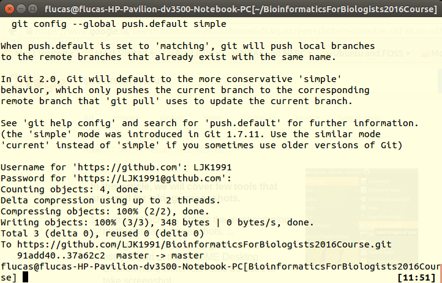
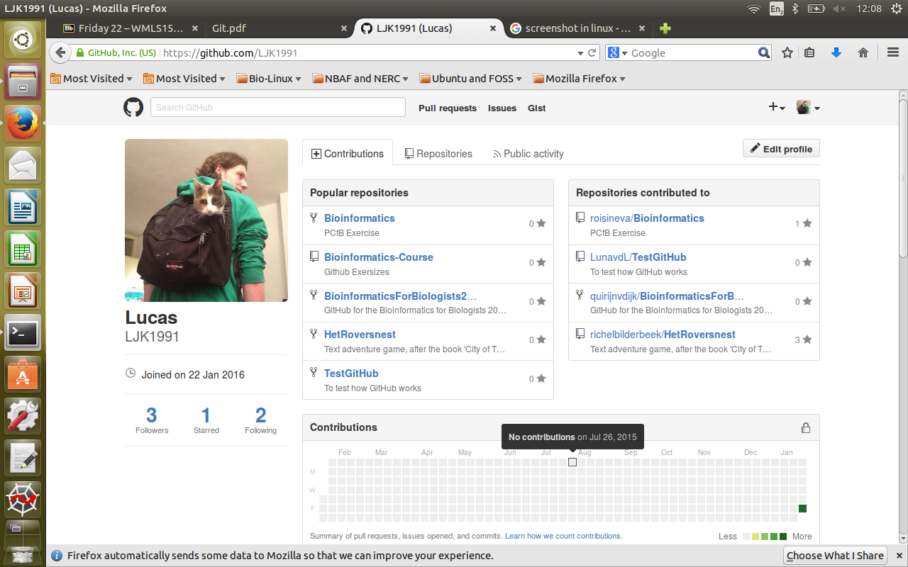
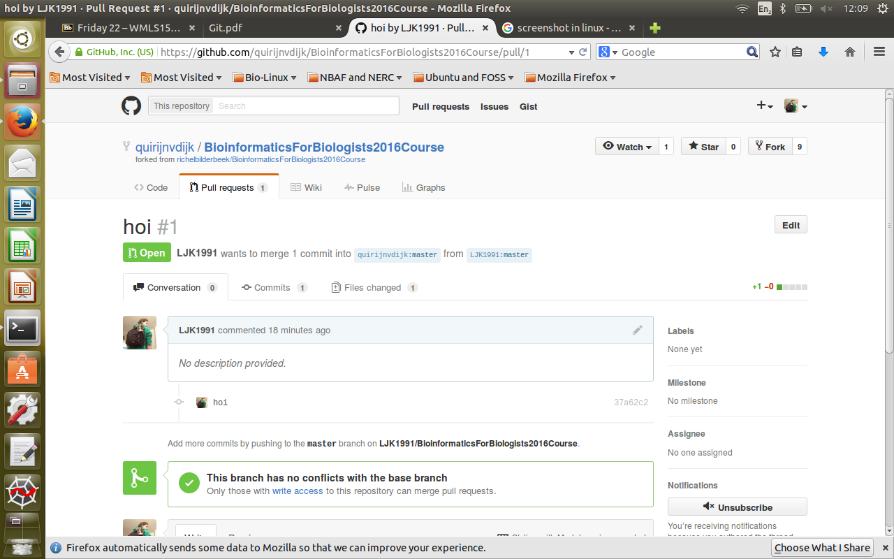
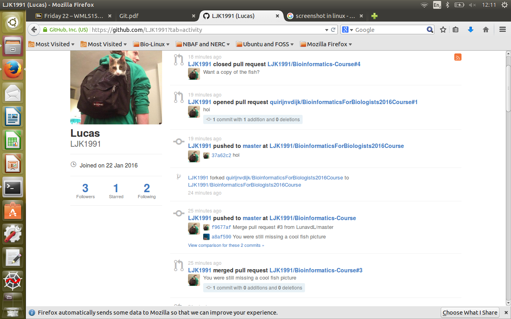

# Bioinformatics-Course
Github Exersizes

Test Test, Im testing github
<<<<<<< HEAD

flucas@flucas-HP-Pavilion-dv3500-Notebook-PC[flucas] git pull https://github.com/LJK1991/Bioinformatics-Course.git
fatal: Not a git repository (or any of the parent directories): .git
flucas@flucas-HP-Pavilion-dv3500-Notebook-PC[flucas] git clone https://github.com/LJK1991/Bioinformatics-Course.git
Cloning into 'Bioinformatics-Course'...
remote: Counting objects: 14, done.
remote: Compressing objects: 100% (13/13), done.
remote: Total 14 (delta 5), reused 0 (delta 0), pack-reused 0
Unpacking objects: 100% (14/14), done.
Checking connectivity... done.

=======
>>>>>>> 7b93b3b8234821b4aa7b584773baeaaea32179b6

